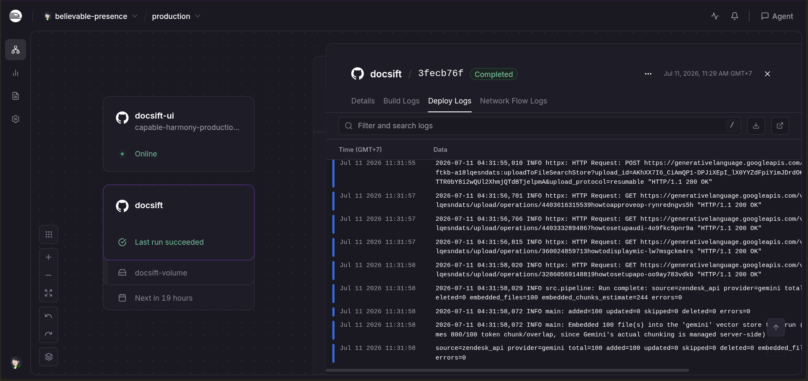
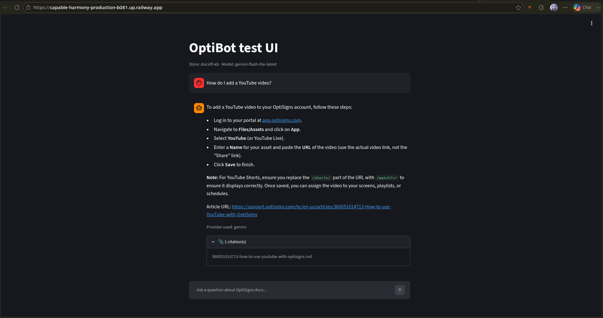

# Docs Knowledge Base Sync


A small pipeline that scrapes a Zendesk help center, converts each article to Markdown, and keeps a Gemini File Search Store in sync with it. Only new or changed articles are re-uploaded on every run (delta sync), and a support chatbot (**OptiBot**) answers questions grounded in that store, with citations back to the source articles.

## Features

- **Two scrape paths**: the Zendesk Help Center API, with an HTML sitemap scraper as a fallback if the API is unreachable.
- **Delta sync**: a local manifest (`data/manifest.json`) tracks each article's hash and `updated_at`, so unchanged articles are skipped instantly and only real changes are re-uploaded.
- **Parallel uploads/deletes**: independent per-article API calls run concurrently instead of one at a time.
- **CLI flags** to force a scrape source, run scrape-only (no AI provider needed), cap the batch size, or dry-run.
- **Streamlit test UI** with streaming answers and citations.
- **CI/CD**: automated tests and a one-article smoke test via GitHub Actions; the daily scheduled scrape runs on Railway (Docker + Cron Schedule + a persistent volume for delta-sync state).

## Setup

1. **Clone the repo and enter it**, then create a virtual environment:
   ```bash
   python -m venv venv
   source venv/bin/activate      # Windows: venv\Scripts\activate
   pip install -r requirements-dev.txt   # or requirements.txt for a runtime-only install
   ```

2. **Copy the env file and fill in your own values:**
   ```bash
   cp .env.sample .env
   ```
   At minimum you need a `GEMINI_API_KEY` (from [Google AI Studio](https://aistudio.google.com)). See `.env.sample` for every other setting (locale, chunk-size estimate, concurrency, etc.) and what it does.

## How to run locally

Run the full pipeline (scrape -> diff -> upload):
```bash
python main.py
```

Useful flags:
```bash
python main.py --source html          # force the HTML fallback scraper (skip the Zendesk API)
python main.py --source api           # force the API only, no fallback if it fails
python main.py --only-scraper --limit 5   # just scrape + write Markdown, no Gemini calls needed
python main.py --dry-run --limit 1    # scrape + diff, but skip real uploads/deletes
```

Run the test suite:
```bash
pytest -q
```

Run with Docker (matches what CI runs):
```bash
docker build -t docsift-scraper .
docker run --rm --env-file .env \
  -v "$(pwd)/data:/app/data" \
  docsift-scraper
```

Try the assistant in a browser (streaming answers + citations):
```bash
pip install streamlit   # already in requirements-dev.txt
streamlit run scripts/streamlit_app.py
```

## Chunking strategy

Gemini File Search Stores chunk documents **server-side** — there is no API parameter to set chunk size or overlap, so the actual chunking is entirely managed by Gemini and isn't something this pipeline controls.

To still give a meaningful "chunks embedded" number in the logs, `src/utils.py` estimates it locally: `tokens ≈ len(text) / 4` (a common rough chars-per-token ratio), then `chunks = ceil(tokens / (chunk_size - overlap))` using `GEMINI_CHUNK_SIZE_ESTIMATE_TOKENS=800` and `GEMINI_CHUNK_OVERLAP_ESTIMATE_TOKENS=100` (both configurable in `.env`). Treat this number as an approximation for observability, not Gemini's real internal chunk count.

## CI/CD & daily job

- `tests.yml` (GitHub Actions) — runs `pytest` on every push/PR.
- `smoke-test.yml` (GitHub Actions, manual) — scrapes + uploads exactly **one** real article, to sanity-check the whole path without touching the rest of the store.
- **Daily scrape job — runs on [Railway](https://railway.app)**, not GitHub Actions. The scraper service is built from `Dockerfile`, scheduled via Railway's **Cron Schedule** (once/day), with a persistent Volume mounted at `/app/data` so `manifest.json` survives between runs and delta sync keeps working. `daily-scrape.yml` still exists for manual/local-style runs but its cron trigger is disabled — Railway is the source of truth for the scheduled job now.
- **Job logs / last run artefact:** since the Railway dashboard isn't publicly linkable, see below for a screenshot of a real scheduled run (added/updated/skipped counts).




## Assistant answering a sample question



> Note: Google AI Studio's Playground does not currently expose a picker for an existing File Search Store, so this sanity check uses the project's own Streamlit UI (`scripts/streamlit_app.py`) / CLI (`scripts/sanity_check.py`) instead — both call the same `file_search` grounding API that AI Studio's Playground would use under the hood.


